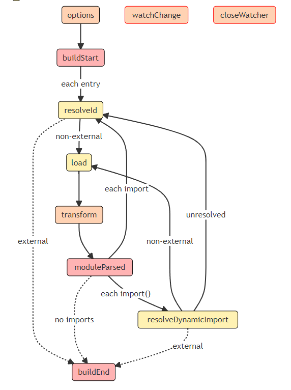
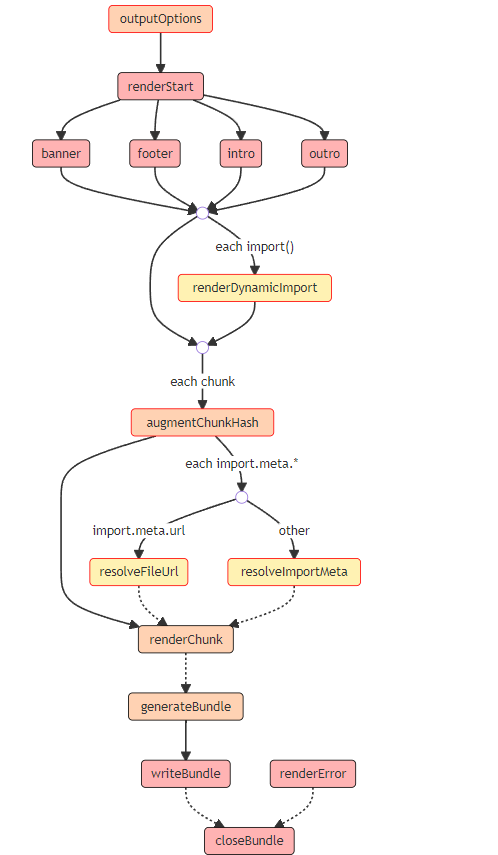

# rollup - vite
## 尽量写成ts 文件，这样可以有很多api 的智能提示，主要有很多参数类型可以查看

### vite官网 https://vitejs.cn/config/#build-terseroptions
> vite 这边大部分都是依赖于rollup 上面的功能

### rollup官网 https://rollupjs.org/
> input 入口配置，可以多个入口文件

> output 出口配置，可以输出多种格式文件

>> 输出格式 output.format
>>> cjs 运行与node 和webpack 上
>>> amd 异步模块，适用于requireJs 使用
>>> umd (主要兼容各种规格，是通用模块定义，需要额外的参数名来接受 window.xxx = '')
>>> iife (输出自执行的js，需要额外的参数名来接受 window.xxx = '')
>>> es (es的模块类型)

>> 输出文件名 output.chunkFileNames,output.entryFileNames,output.assetFileNames
>>> chunkFileNames 打包时候产生的公共模块
>>> entryFileNames 对应input上入口文件的键值
>>> assetFileNames 资源文件的输出

>> 手动设置块的输出 output.manualChunks
>>> rollup 打包的时候，会根据文件的引用，把公共资源进行抽取成单一文件，这里可以对这些公共资源进行输出设置（感觉上就是以不同的名称输出）

### 这两个构建工具主要的还是在插件上
> 在开发插件的时候，可以用到很多node 的api
> 使用插件的时候不要写箭头函数，不然this 拿不到上下文

    <a href="https://rollupjs.org/guide/en/#plugin-context">插件上下文</a>

### 以下是rollup 的钩子

    
构建钩子

    

    
输出钩子

    

### 一下是vite 独有的，同时兼容rollup 的钩子

    <a href="https://cn.vitejs.dev/guide/api-plugin.html#vite-specific-hooks">vite 独有钩子</a>

